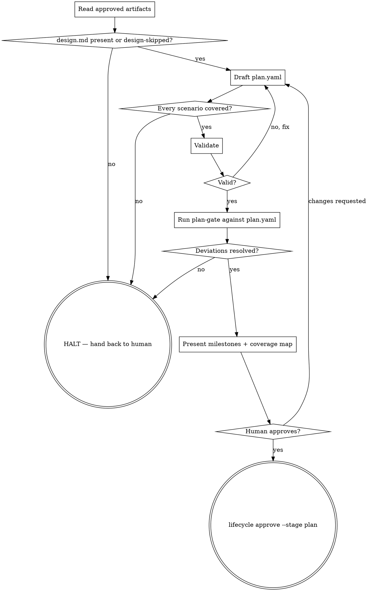

# lifecycle-plan

Conduct the plan stage of ONE change, in a fresh session, and stop at gate 3.
Your entire input is the gate-approved artifacts on disk — `proposal.md`,
`specs/**/spec.yaml`, and `design.md` unless gate 1 recorded a design-skip.
Read them from disk now, before drafting anything.

The artifact is `openspec/changes/<change>/plan.yaml`. Its grammar, its contract
keys, and the CLI that validates it belong to `milestoned-plan-dag` — follow the
`plan-author` skill for all of that. This skill owns what the format cannot
know: which approved requirement each milestone discharges, and whether the plan
is self-contained enough to hand to an implementer.

## Checklist

Create a task for each of these and complete them in order:

1. Read the approved artifacts from disk
2. Draft `plan.yaml` following `plan-author`
3. Build the coverage map — every delta scenario to the milestone that discharges it
4. Validate
5. Run the constitution plan-gate against `plan.yaml`; resolve every deviation
6. Present the milestones and the coverage map to the human
7. Approve, only on their explicit go-ahead

## Self-contained is the bar

The implementer runs on a cheaper model than you, in a fresh session, with one
milestone in front of it. Every milestone carries what it needs to start: the
files and types it creates, the tests it adds by name, and its acceptance
criteria written out. A milestone that says "as described in the design" is not
self-contained — the **names** go in the milestone; the **rationale** stays in
`design.md`, in the same worktree, for when the implementer wants the why.

## The chain

Every scenario in this change's `specs/**/spec.yaml` deltas lands in exactly one
milestone and travels this chain:

```
spec.yaml scenario → milestone criterion (given/when/then, written out) → named test → green check
```

- **`criteria`** — one structured entry per scenario the milestone discharges.
  Copy the scenario's `given`/`when`/`then` out in full; the implementer never
  opens the delta to read them. Set `name` to the test that proves it —
  `internal/widget/api_test.go::TestCreateRejectsEmptyName`.
- **`check`** — this repo's standard validation command, the one a maintainer
  runs before pushing. The same command on most milestones is correct: it proves
  nothing regressed and that the new tests ran inside the real suite. The named
  tests carry the per-milestone specificity.
- **`paths`** — the write-set, narrow enough that a diff outside it is a real
  signal.

## Components come from design.md

`design.md`'s **Components & Interfaces** section is the approved decomposition.
Project it into each milestone's `deliverables.create` / `modify` / `test`: file
path, type name, one-line responsibility. Do not redesign it here.

A design-skipped change (`designSkipped: true` on the refine gate — check with
`lifecycle status --change <change>`) has no components section. If the work
needs one, the design-skip was wrong: say so and send it back rather than
inventing an architecture at the plan stage.

## HALT

Stop, write nothing, and hand back to the human when:

- a scenario in the delta has no milestone that could discharge it without work
  nobody approved;
- the plan would need a component the approved artifacts never name;
- `design.md` is absent and the change was not design-skipped;
- the plan-gate reports a deviation against `plan.yaml` that is neither
  conformed nor amended — even when the change was design-skipped; a skipped
  design does not skip the constitution gate (spec-lifecycle.md §3.2).

## Gate mechanics



1. Draft `openspec/changes/<change>/plan.yaml` following `plan-author`.
2. Validate, and fix every finding:
   ```
   milestoned-plan-dag validate openspec/changes/<change>/plan.yaml
   lifecycle validate --stage plan --change <change>
   ```
3. Invoke `/plan-gate` (the companion `adr-sourced-constitution` primitive's
   skill) against the validated `plan.yaml` — **this stage's artifact**, not
   gate 2's `design.md`, and not whatever `deviation.json` gate 2 already left
   in this folder: that record was graded against `design.md`; gate 3 needs
   its own, graded against the plan (spec-lifecycle.md §3.3, §7.5). This
   applies even when the change was design-skipped — a skipped design does
   not skip the constitution gate; the plan-gate still runs at gate 3
   (spec-lifecycle.md §3.2). **Explicitly tell `/plan-gate` to write its
   report to `<changefolder>/deviation.json`** — overwriting gate 2's copy,
   which is expected; gate 3 only needs its own — instead of its own default
   `./deviation.json`. This is a plain instruction to the skill, not a
   `lifecycle` CLI flag; `lifecycle approve` only ever reads `deviation.json`
   from that fixed path, so getting the write location right here is
   load-bearing. Resolve every deviation `/plan-gate` reports **conform or
   amend** before moving on: either change `plan.yaml` so it no longer
   conflicts, or accept an ADR proposal that amends the rule (the
   constitution primitive's consent flow — its own `adr-draft`/
   `constitution adr new` path, gated by its own permission prompt). Do not
   carry an unresolved deviation into the human review in step 4.
4. **List the milestones back to the human as skimmable bullets** — one line
   each: number, goal, and the tests it adds. Most plans are skimmed, not read;
   this summary is what actually gets reviewed. Follow it with the coverage map:
   every scenario in the delta and the milestone that discharges it, and the
   validated `deviation.json`'s outcome.
5. Wait for explicit approval or requested changes. On requested changes, revise
   and return to step 2.

<HARD-GATE>
6. Only after the human's explicit, conversational approval of the exact plan
   you just showed them:
   ```
   lifecycle approve --stage plan --approve <change>
   ```
   This command is mutating — leave it out of every pre-approved-command /
   `allowed-tools` list; the harness's permission prompt on this exact command
   is the second, independent consent checkpoint, and `--approve` does not
   replace it. Silence is not approval.
</HARD-GATE>

Gate 3 hashes `plan.yaml` into the gate entry, so the approved plan is the
executed plan. After this, a plan change is a new gate decision, not an edit:
the orchestrator handles deviations during execution and reports them
afterwards.

## Red flags

| Thought | Reality |
|---|---|
| "The implementer can read design.md for the class names" | It gets one milestone. The names go in the milestone. |
| "`criteria: the feature works`" | A verifier cannot grade that. One entry per scenario, named test, given/when/then. |
| "`check: go test ./internal/foo/...`" | Scoping the check to the milestone hides regressions. Use the repo's standard command. |
| "`paths: ['**']`" | An unconfined write-set makes the diff gate vacuous. |
| "The design didn't cover this, I'll decide it here" | Plan-stage architecture is ungated architecture. HALT. |
| "Gate 2's `deviation.json` already covers this" | It graded `design.md`. Gate 3 re-runs `/plan-gate` against `plan.yaml` and writes its own report — even on a design-skipped change. |
| "Milestone 4 finishes what milestone 3 started" | Every milestone ends green on the standard check. |
| "The plan validates, so it's ready" | `validate` grades grammar, never self-containment. Read one milestone alone and see if you could start. |
